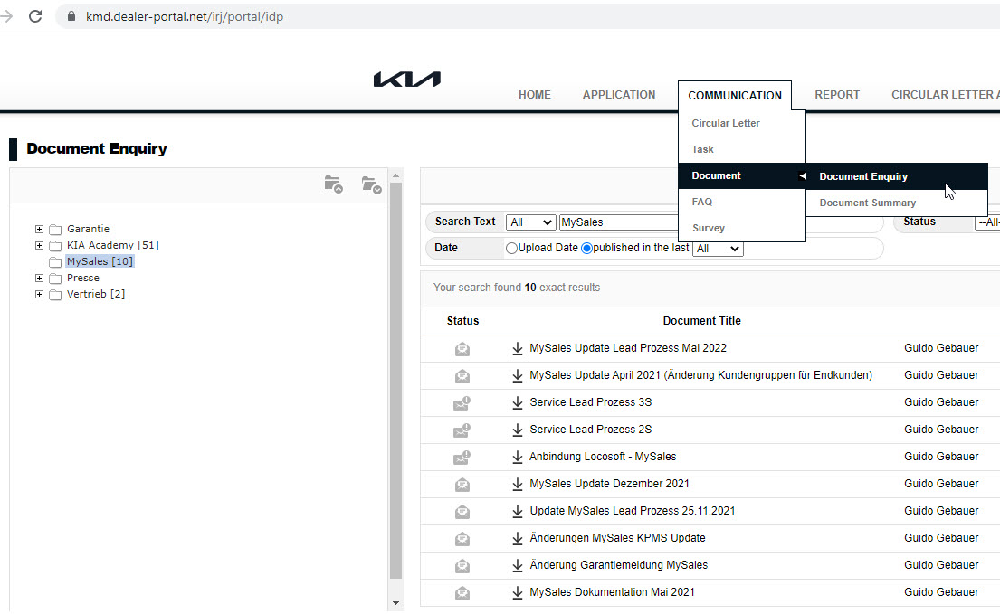

# Tag 1

## Ist-Analyse

Gehe auf die folgende Webseite und führe die Ist-Analyse durch.
Schriebe auf, welche Problemen die aktuelle Anleitungsammelung hat.

- URL: https://kmd.dealer-portal.net
- ID: ...
- Password: ...

## Soll-Analyse

Wie kann eine Lösung aussehen? Die Lösung sollte folgende Anforderung erfüllen:

* Schreiben von Anleitungen direkt im System (Kein Hochladen von PDF-Dateien)
* Navigation nach Themen
* Suchfunktion

## Static Site Generator

Mit einem "Static Site Generator" kann man schnell eine statische Webseite bauen. Da die Anleitungen in der Regel keine dynamische Inhalte (Reagiert auf User-Eingabe) enthält, kann ein "Static Site Generator" eine gute Lösung für unser Vorhaben sein.

Es gibt viele "Static Site Generator"-Lösungen. Suche im Google nach "Static Site Generator".

Die folgende Website listet die "Static Site Generator"-Lösungen nach Programmiersprache oder nach Populärität.
Suche dir einige Lösungen aus und schau dir genauer an, wie die jeweilige Lösung aussieht. Schreibe die Vor- und Nachteile der Lösungen auf und beschreibe, warum du sie ausgesucht hast. 

[https://jamstack.org/generators/](https://jamstack.org/generators/)

## Markdown

[https://markdown.de/](https://markdown.de/)